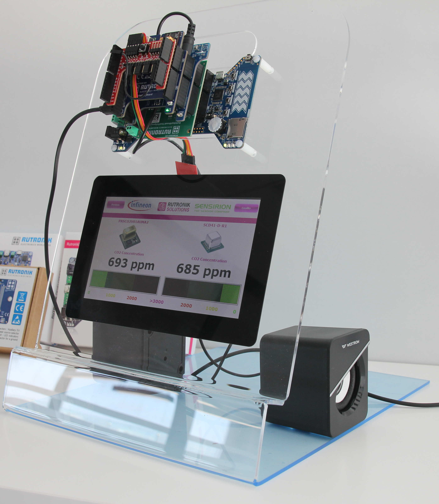
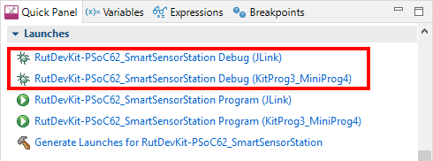

# RutDevKit-PSoC62 Smart Sensor Station

Rutronik Development Kit Programmable System-on-Chip CY8C6245AZI-S3D72 "Smart Sensor Station" ModusToolbox Project. 

This project demonstrates various technologies from the [Rutronik System Solutions](https://www.rutronik.com/innovations).

#### The hardware list

- [RDK2](https://www.rutronik.com/rutronik-system-solutions/rutronik-development-kit-rdk2)
- [RAB1-SENSORFUSION](https://www.rutronik.com/rutronik-system-solutions/rutronik-adapter-board-rab1-sensorfusion) [first prototype]
- [RAB2-CO2](https://www.rutronik.com/rutronik-system-solutions/rutronik-adapter-board-rab2-co2) [first prototype]
- [TEXT TO SPEECH](https://www.rutronik.com/rutronik-system-solutions/rutronik-adapter-board-text-to-speech)
- [SK-GEN4-70DCT-CLB](https://4dsystems.com.au/gen4-ulcd-70dct-clb-sb)
- [4D-ARDUINO-ADAPTOR-SHIELD-II](https://4dsystems.com.au/4d-arduino-adaptor-shield-ii)

 

## Requirements

- [ModusToolbox® software](https://www.infineon.com/cms/en/design-support/tools/sdk/modustoolbox-software/) v2.4

### Using the code example with a ModusToolbox IDE:

1. Import the project: **File** > **Import...** > **General** > **Existing Projects into Workspace** > **Next**.
2. Select the directory where **"RutDevKit-PSoC62_SmartSensorStation"** resides and click  **Finish**.
3. Update the libraries using a **"Library Manager"** tool.
4. Select and build the project **Project ** > **Build Project**.

### Debugging

If you successfully have imported the example, the debug configurations are already prepared to use with a the KitProg3, MiniProg4, or J-link. Open the ModusToolbox perspective and find the Quick Panel. Click on the desired debug launch configuration and wait for the programming to complete and debug process to start.

## Legal Disclaimer

The evaluation board including the software is for testing purposes only and, because it has limited functions and limited resilience, is not suitable for permanent use under real conditions. If the evaluation board is nevertheless used under real conditions, this is done at one’s responsibility; any liability of Rutronik is insofar excluded. 

